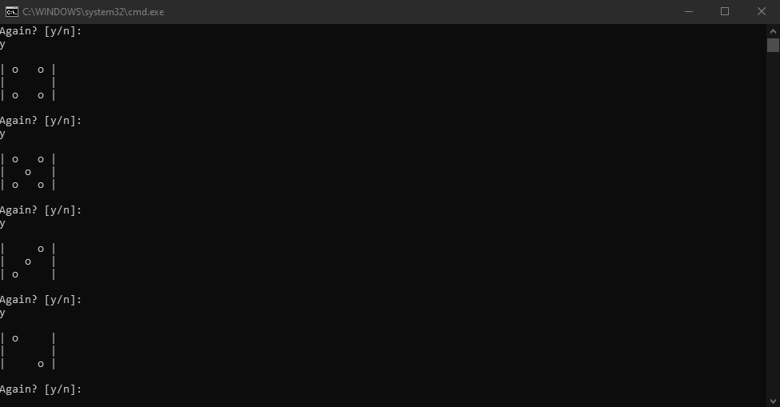

# Dice Simulator
Simulates the rolling of a dice

## Visual demonstration

## Pseudocode
- random numbers from 1 - 6 are generatd and stored in variable `number`
- if statements e.g if random number was 5, print 5 dots
- loop game. 
- in every loop ask user if to continue